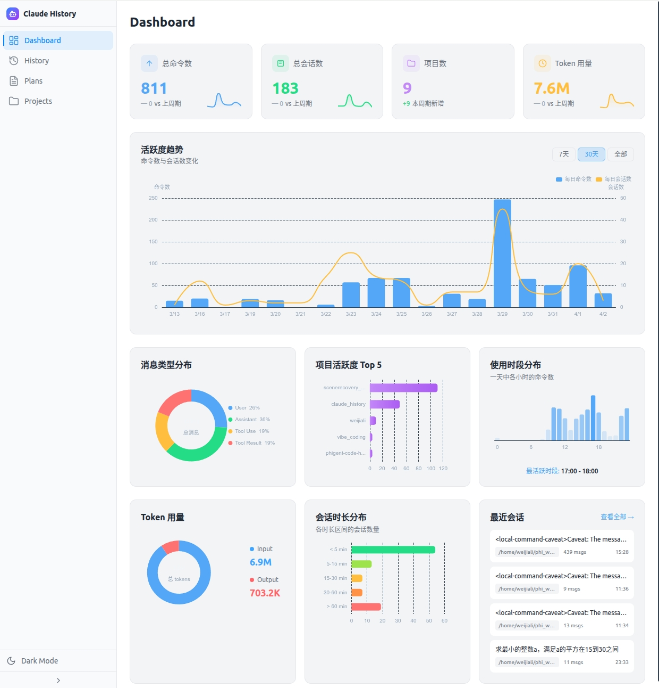
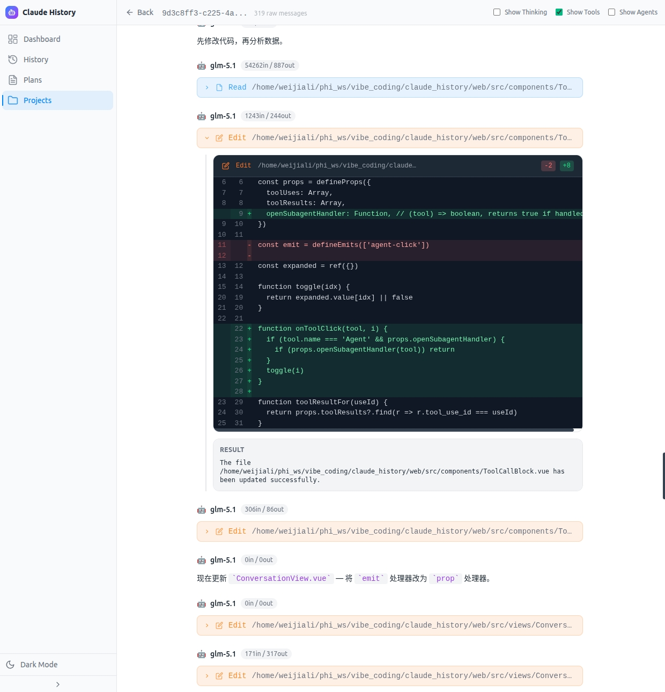
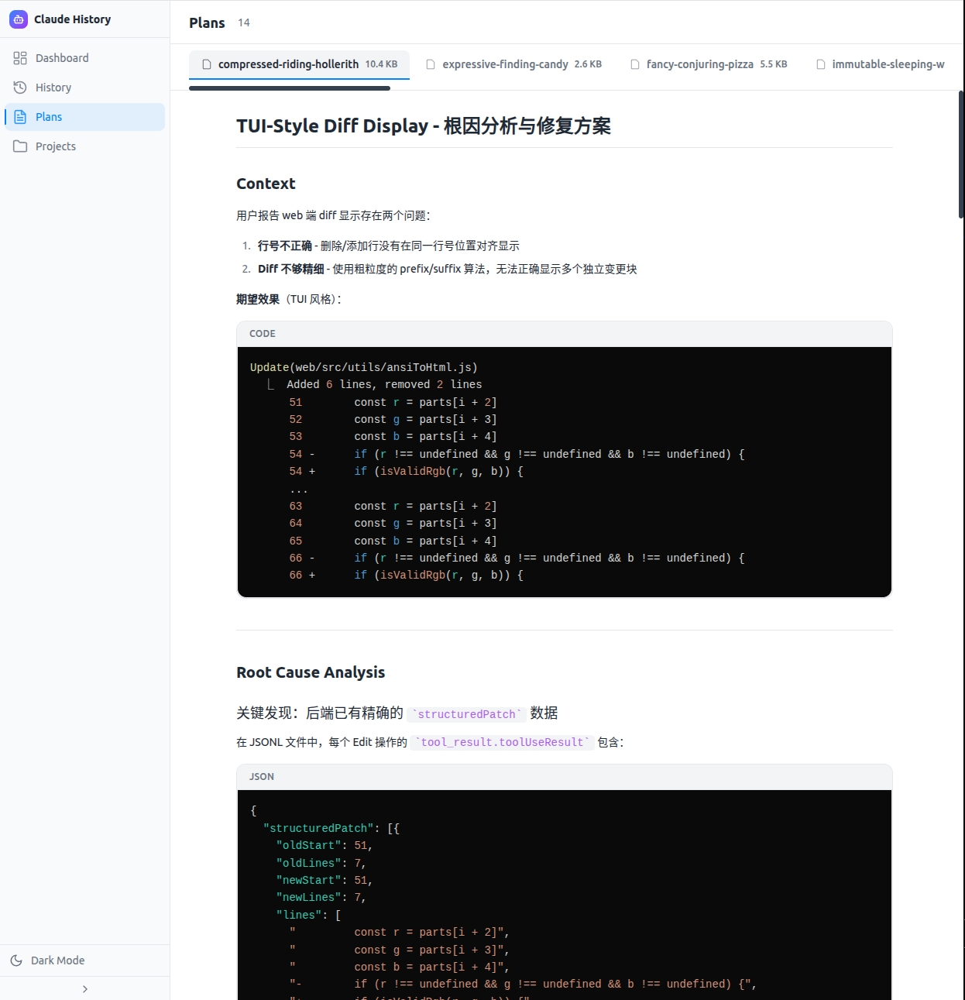
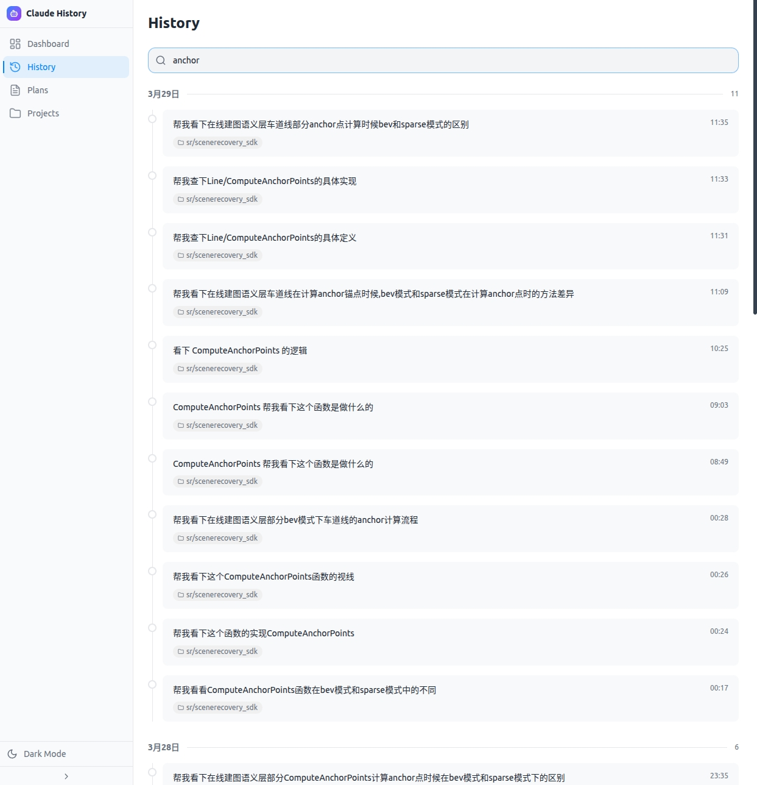
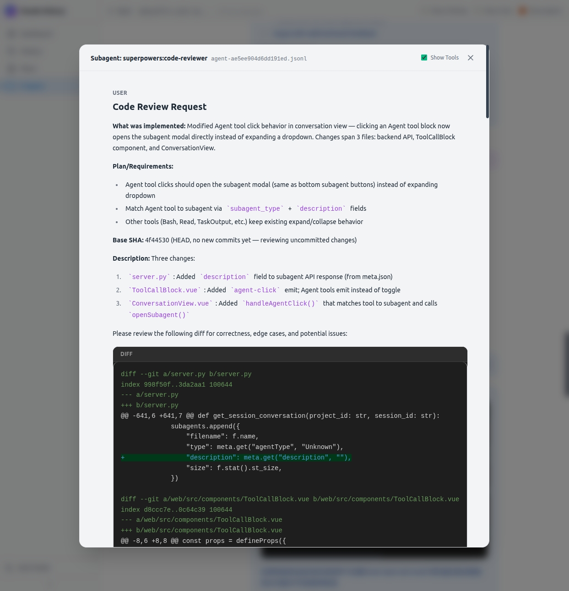

<div align="center">


# Claude History Viewer

**[Claude Code](https://claude.ai/code) 会话记录可视化查看器**

读取本机 `~/.claude/` 下的数据，通过美观的 Web 界面展示对话历史、实施计划、项目会话等内容。

[](https://github.com/liweijia1243/claude_history/releases/latest) [](https://opensource.org/licenses/MIT) [](https://github.com/liweijia1243/claude_history/releases) [](https://www.python.org/) [](https://vuejs.org/)

**Languages**: [中文](README.md) | [English](README.en.md)

[下载安装](https://github.com/liweijia1243/claude_history/releases) · [从源码运行](#从源码运行) · [功能预览](#功能预览) · [报告问题](https://github.com/liweijia1243/claude_history/issues)

</div>

---

## 截图预览

<p align="center">
  
  
</p>
<p align="center">
  
  
</p>
<p align="center">
  
</p>

---

## 功能预览

### 核心功能

| 功能 | 描述 |
|------|------|
| **Dashboard** | 统计概览 — 命令数、计划数、项目数、24h 活跃度热力图 |
| **History** | 可搜索的命令历史，支持按项目筛选，点击直达对应会话 |
| **Plans** | Markdown 计划文件渲染查看，支持多计划浏览 |
| **Projects** | 按项目浏览所有会话，自动映射项目目录名到实际路径 |
| **Conversation** | 聊天气泡 UI — 可折叠思维块、可展开工具调用面板、子代理弹窗、代码 Diff 视图 |

### 对话页面亮点

| 特性 | 描述 |
|------|------|
| Thinking Block | 可折叠的 Claude 思维过程展示 |
| Tool Call Panel | 可展开的工具调用详情（文件读写、搜索、Bash 等） |
| Code Diff | 文件修改的 Diff 视图，语法高亮 |
| Sub-agent Dialog | 点击 Agent 工具直接弹出子代理对话窗口 |
| Code Highlight | 多语言代码块语法高亮（highlight.js） |
| Markdown 渲染 | 助手回复中的 Markdown 实时渲染 |

### 特色功能

**Search & Jump** — 在 History 和 Projects 页面的搜索结果中**双击**任意条目，自动跳转到对应会话并精确定位到该条消息位置。

**Show Thinkings / Show Tools / Show Agents** — 对话页面顶部的三个切换开关，支持按需显示或隐藏思维过程、工具调用、Agent 调用，方便以不同粒度 review 对话内容。

**Sub-agent Dialog** — 对话中遇到 Agent 工具调用时，点击即可弹出子代理的完整对话窗口，无需离开当前页面即可深入查看子代理的工作过程。

---

## 安装（Ubuntu 20.04+）

从 [GitHub Releases](https://github.com/liweijia1243/claude_history/releases/latest) 下载最新的 `.deb` 文件：

```bash
# 安装
sudo dpkg -i claude-history_*.deb
sudo apt-get install -f  # 自动安装缺失依赖

# 启动
claude_history

# 停止 — 按 Ctrl+C 即可
```

启动后自动在浏览器中打开 `http://localhost:8787`。

### 命令行参数

```
claude_history [选项]

选项:
  --port <端口>  指定服务端口 (默认: 8787)
  --shared       允许局域网内其他设备访问 (默认仅本机)
  --help, -h     显示帮助信息

示例:
  claude_history                # 本机 8787 端口启动
  claude_history --port 9000    # 指定端口启动
  claude_history --shared       # 允许局域网访问
```

> **安全提示：** 默认仅绑定 `127.0.0.1`，会话历史仅本机可访问。使用 `--shared` 会绑定 `0.0.0.0`，局域网内所有设备均可访问。

---

## 从源码运行

**依赖：** Python 3.8+, Node.js 18+

```bash
# 克隆仓库
git clone https://github.com/liweijia1243/claude_history.git
cd claude_history

# 安装 Python 依赖
pip install -r requirements.txt

# 安装前端依赖
cd web && npm install && cd ..

# 同时启动前后端（开发模式）
./start.sh
```

- 前端开发服务器：`http://localhost:5173`
- 后端 API：`http://localhost:8787`

也可以单独启动生产模式（前端已构建）：

```bash
cd web && npm run build && cd ..
python server.py              # 仅本机访问
python server.py --shared     # 允许局域网访问
python server.py --port 9000  # 指定端口
python server.py --no-open    # 不自动打开浏览器
```

---

## 技术栈

| 层级 | 技术 |
|------|------|
| 后端 |  Python 3.8+ |
| 前端 |   |
| 构建 |  npm |
| 代码高亮 | highlight.js |

---

## 架构

```
server.py          # FastAPI 后端，直接读取 ~/.claude/ 数据，无数据库
web/               # Vue 3 + Tailwind CSS 前端
  src/
    views/         # 页面组件（Dashboard, History, Plans, Projects, Conversation）
    components/    # 公共组件（CodeBlock, DiffBlock, ToolCallBlock, ThinkingBlock）
    composables/   # 组合式函数
    utils/         # 工具函数
```

### 数据来源

| 路径 | 内容 |
|------|------|
| `~/.claude/history.jsonl` | 所有用户命令 |
| `~/.claude/plans/*.md` | 实施计划（Markdown） |
| `~/.claude/projects/<dir>/*.jsonl` | 项目会话的完整对话 |
| `~/.claude/projects/<dir>/<session>/subagents/` | 子代理对话 |

### 数据隐私

**100% 本地运行。** 所有数据直接从本机 `~/.claude/` 目录读取，不上传任何数据到外部服务器，无需 API Key。

---

## 构建 .deb 包

```bash
./build_deb.sh
```

推送版本 tag 触发 GitHub Actions 自动构建发布：

```bash
git tag v0.0.4
git push origin v0.0.4
```

---

## License

[MIT](LICENSE)
